# TextCard Studio - 小红书文字卡片生成器

<div align="center">

**🎯 面向小红书创作者的 Markdown / AI 排版文字卡片工具**

把长文、笔记、教程和观点稿快速生成 3:4 高清系列卡片，支持智能分页、模板切换、本地 Canvas 渲染和批量导出。

[](https://github.com/88lin/TextCard-Studio)
[]()
[]()

🌐 [在线体验](https://88lin.github.io/TextCard-Studio/) | 🚀 [打开编辑器](https://88lin.github.io/TextCard-Studio/editor.html) | 📖 [使用指南](https://88lin.github.io/TextCard-Studio/guide.html)

</div>

---

## 项目简介

TextCard Studio 是一款纯前端的小红书文字卡片生成器。你可以输入 Markdown 或已经排版好的 AI 文案，选择模板后在浏览器中实时预览，并导出适合小红书发布的 1242 x 1656 高清图片。

项目不依赖后端服务，核心的 Markdown 解析、智能分页、Canvas 渲染和图片导出都在浏览器本地完成。适合内容创作者、公众号作者、知识博主和需要批量生成图文卡片的个人项目使用。

## 效果预览

<div align="center">

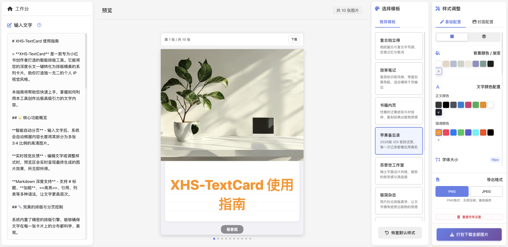

*实时预览、智能分页、一键导出*

</div>

## 核心特性

| 能力 | 说明 |
|:--|:--|
| Markdown 转图片 | 支持标题、加粗、高亮、引用、列表、代码、分割线和强制分页 |
| 智能分页 | 根据内容高度自动拆分为多张 3:4 文字卡片 |
| 模板系统 | 内置多款适合小红书图文发布的卡片模板 |
| 本地渲染 | 使用 Canvas 在浏览器本地生成图片，不上传正文内容 |
| 高清导出 | 输出 1242 x 1656 图片，支持单张下载和批量打包 |
| 样式微调 | 支持字号、行高、字间距、内边距、颜色、封面、水印等配置 |
| AI 排版友好 | 可直接粘贴 AI 整理后的 Markdown / 小红书风格文案继续出图 |

## 模板预览

<div align="center">

| 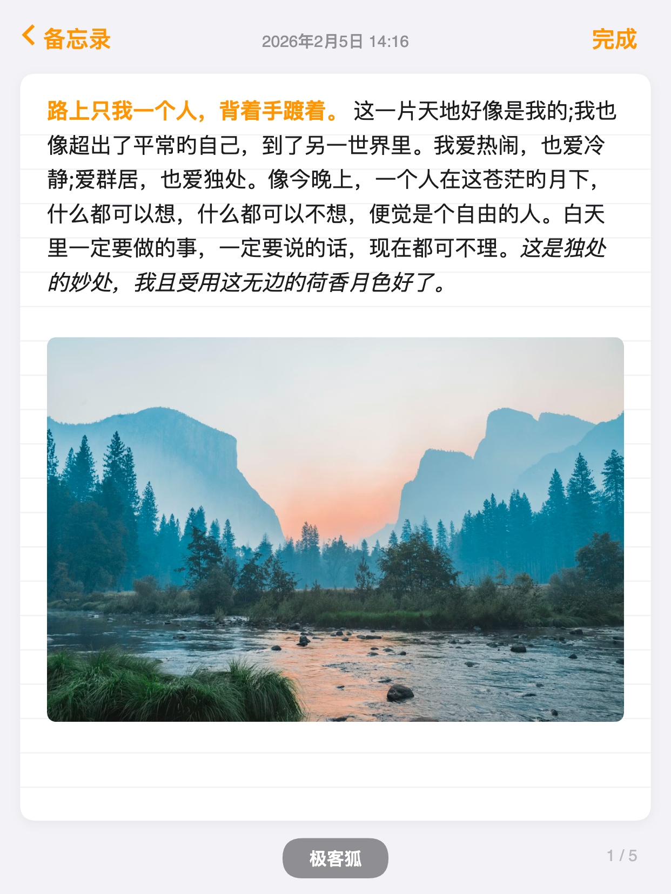 | 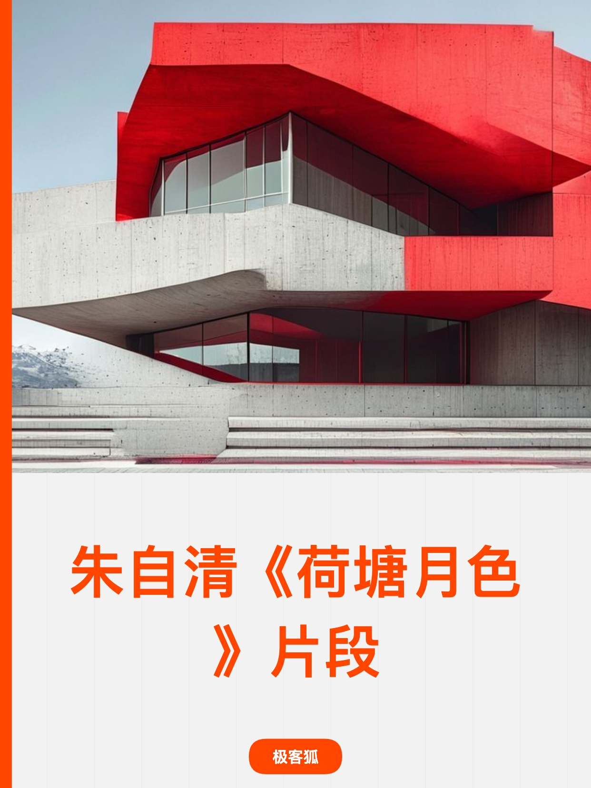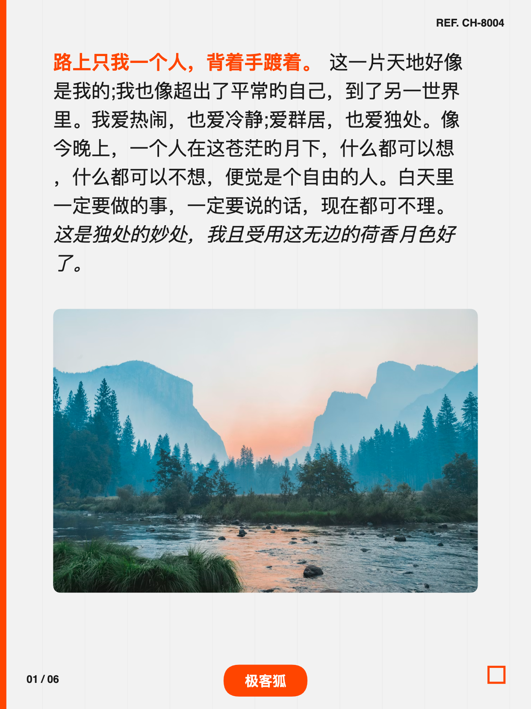 |
|:--:|:--:|
| 苹果备忘录 | 苏黎世工作室 |

| 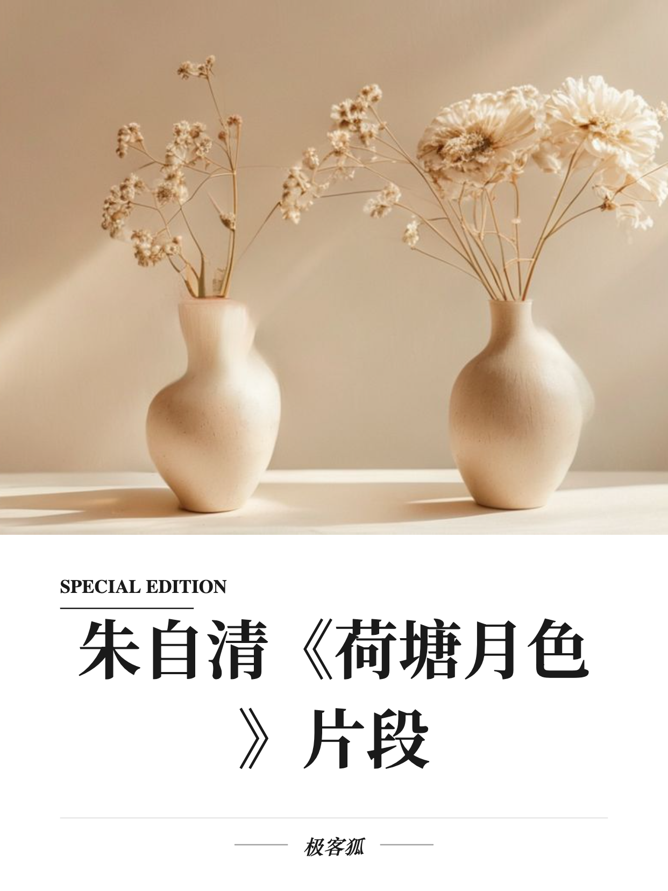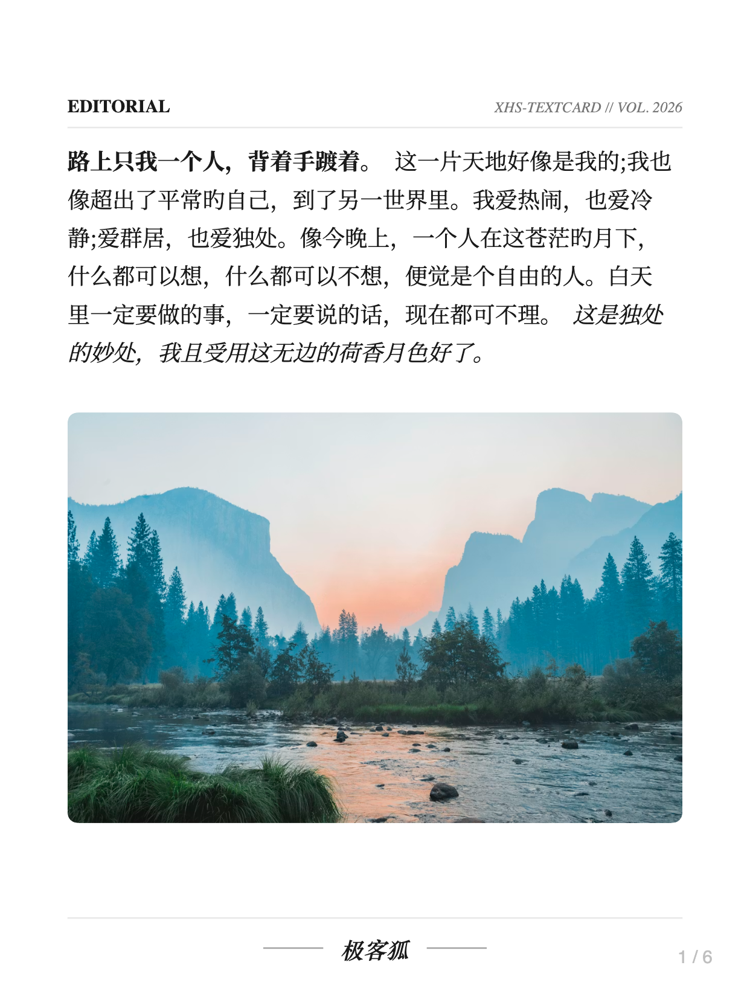 | 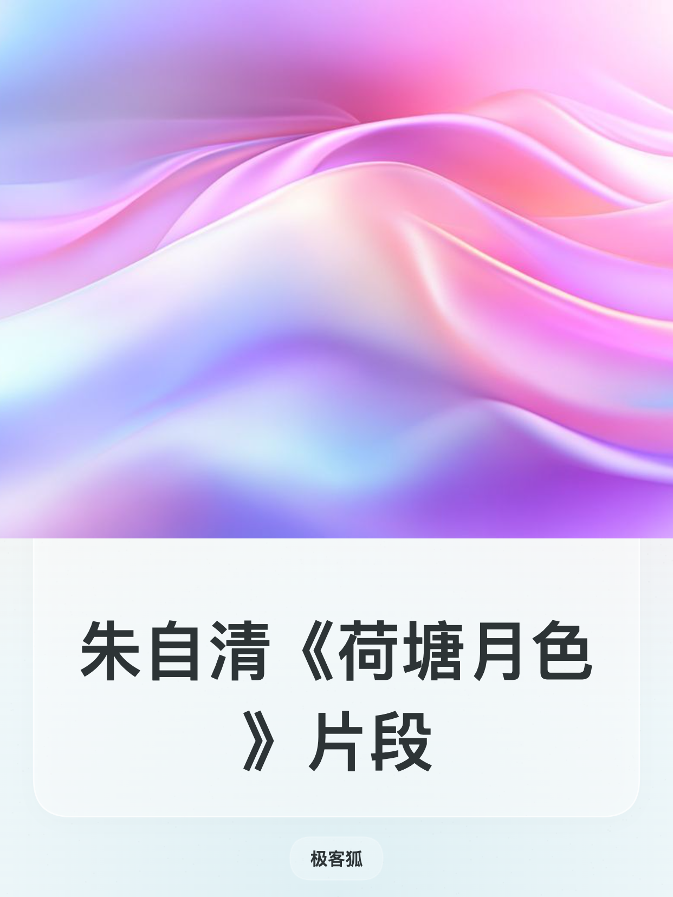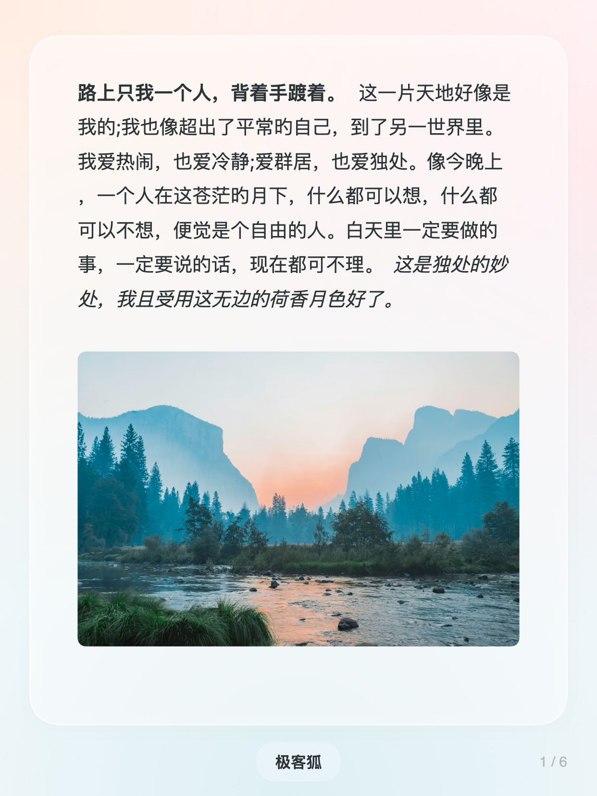 |
|:--:|:--:|
| 极简杂志 | 弥散极光 |

| 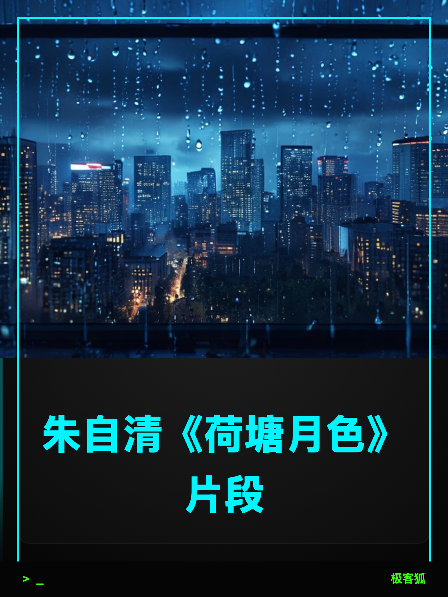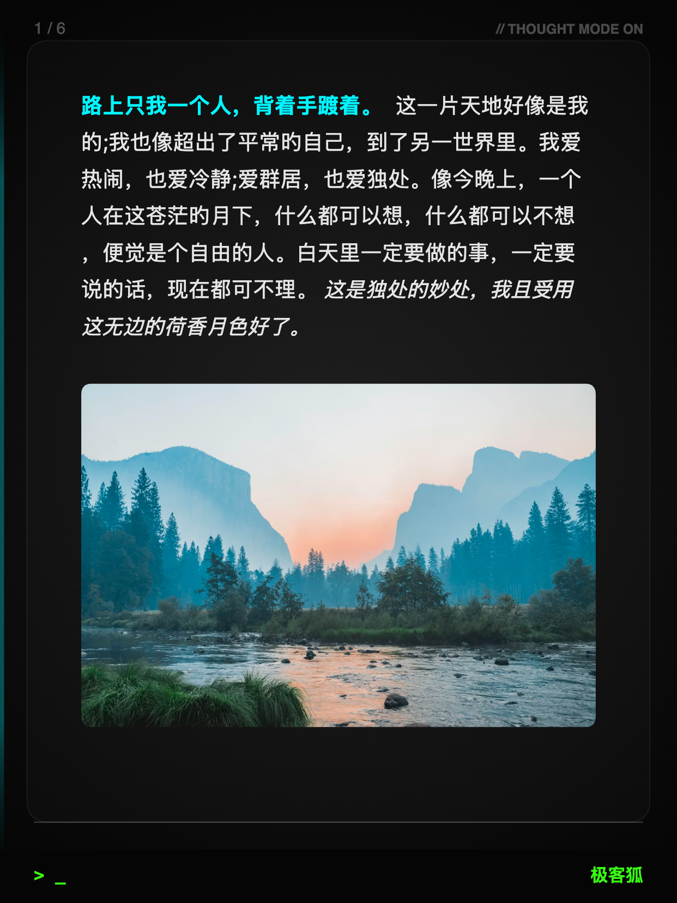 | 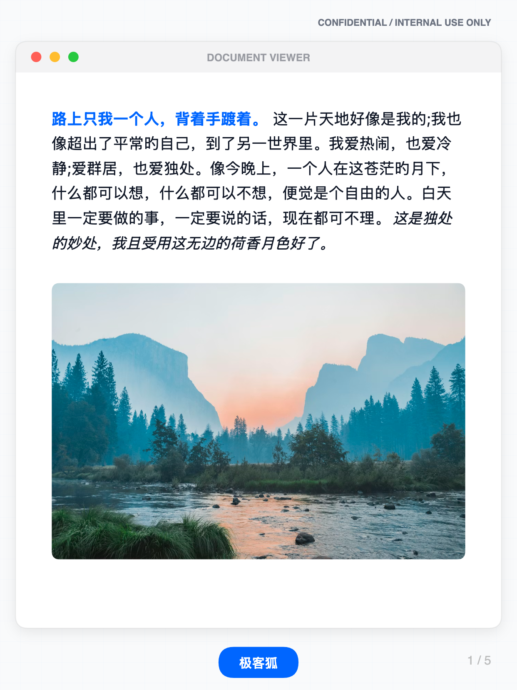 |
|:--:|:--:|
| 暗夜深思 | 大厂文档 |

</div>

## 快速开始

### 在线使用

直接访问：

- 首页：<https://88lin.github.io/TextCard-Studio/>
- 编辑器：<https://88lin.github.io/TextCard-Studio/editor.html>
- 使用指南：<https://88lin.github.io/TextCard-Studio/guide.html>

### 本地运行

```bash
git clone https://github.com/88lin/TextCard-Studio.git
cd TextCard-Studio

python -m http.server 8000
```

然后在浏览器打开：

```text
http://localhost:8000/editor.html
```

由于浏览器安全策略，不建议直接双击 `editor.html` 打开。

### 一键部署

[](https://vercel.com/new/clone?repository-url=https://github.com/88lin/TextCard-Studio)
[](https://app.netlify.com/start/deploy?repository=https://github.com/88lin/TextCard-Studio)

## Markdown 写法

| 写法 | 效果 |
|:--|:--|
| `# 一级标题` | 大标题 |
| `## 二级标题` | 小节标题 |
| `**重点内容**` | 加粗强调 |
| `==高亮内容==` | 高亮标记 |
| `> 引用内容` | 引用块 |
| `---` | 强制分页 |
| `::: center ... :::` | 居中段落 |

更多示例见：[排版示例](https://88lin.github.io/TextCard-Studio/format-demo.html)。

## 项目结构

```text
TextCard-Studio/
├── index.html              # 首页
├── editor.html             # 在线编辑器
├── guide.html              # 使用指南
├── format-demo.html        # 排版示例
├── css/                    # 样式文件
├── js/                     # 渲染、分页、导出与编辑器逻辑
├── templates/              # 模板配置
├── assets/                 # 封面图、模板图和 README 资源
└── data/                   # 默认文本内容
```

## 开发说明

项目是静态前端结构，无需安装 npm 依赖。主要模块：

- `js/App.js`：应用入口和状态调度
- `js/TextSplitter.js`：文字分页
- `js/CanvasRenderer.js`：Canvas 绘制
- `js/PreviewGenerator.js`：预览生成
- `js/DownloadManager.js`：图片导出和打包下载
- `js/TemplateManager.js`：模板加载
- `js/TemplateDefinitions.js`：模板绘制逻辑

新增模板通常需要：

1. 在 `templates/` 新建模板 JSON。
2. 在 `templates/index.json` 注册模板。
3. 如需特殊视觉效果，在 `js/TemplateDefinitions.js` 增加绘制逻辑。
4. 打开 `editor.html` 验证模板预览和导出效果。

## 隐私说明

TextCard Studio 的基础编辑、分页、预览和导出流程均在浏览器本地完成。正文内容不会因为生成图片而上传到服务器。

如果你在自己的部署中接入 AI 排版、云端存储或自动化接口，请根据实际功能补充隐私说明和服务条款。

---

<div align="center">

**释放文字的力量，让内容成为卡片**

</div>
